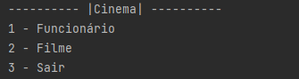
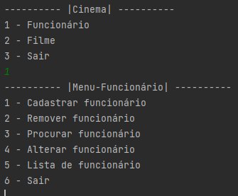
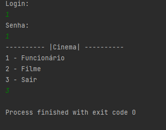

    CRUD - POO para Avaliação 1
Versão 1.0
#### Um sistema com os conceitos básicos de orientação a objeto (encapsulamento, herança e polimorfismo)

### Aluno: Francisco Pontes de Lima Neto
#### Centro Universitário Farias Brito - Prof Lucas Carvalho

## VISÃO GERAL

Um sistema de cadastro de funcionários e filmes para um determinado cinema utilizando ArrayList para guardar os objetos (funcionários e filmes) na memória do computador. O sistema é composto por classes, são elas: Pessoa, Endereço, Funcionário, Gerente, Atendente, Limpeza, Administrador, Filmes e 2 interfaces sendo iFuncionarios e iFilmes para os objetos funcionário e filmes respectivamente.

## OBJETIVOS

Apresentar o sistema CRUD de cadastro de funcionários e filmes. 

Utilizar dos conceitos de encapsulamento, herança, polimorfismo, relacionamento entre classes para mostrar o cadastro por adição,remoção,procura e listagem de funcionários e filmes no cinema.

## CÓDIGO

O arquivo do código está na pasta src. Dentro da pasta existe duas outras pastas, src/model e src/viewCine. Onde src/model está as classes e interfaces e a src/viewCine está a classe principal main.

## Imagens do sistema:

